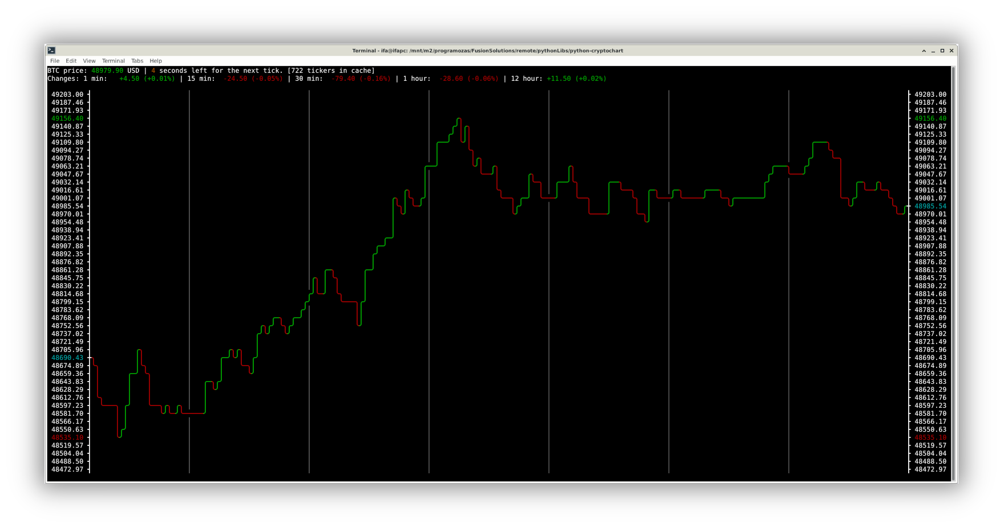

[](https://github.com/FusionSolutions/python-cryptochart/actions/workflows/python-package.yml)
# Terminal chart for crypto currencies



## Introduction

Live minute chart feeded by kraken trought websocket.

## Installation

Requires python version 3.7 or later.

To install the latest release on [PyPI](https://pypi.org/project/python-cryptochart/),
simply run:

```shell
pip3 install python-cryptochart
```

Or to install the latest version, run:

```shell
git clone https://github.com/FusionSolutions/python-cryptochart.git
cd python-cryptochart
python3 setup.py install
```

## Python library

### Usage

```shell
python3 -m cryptochart [btc or eth]
```

## Contribution

Bug reports, constructive criticism and suggestions are welcome. If you have some, create an issue on [github](https://github.com/FusionSolutions/python-cryptochart/issues).

## Copyright

All of the code in this distribution is Copyright (c) 2021 Fusion Solutions Kft.

The tool is made available under the GNU General Public license. The included LICENSE file describes this in detail.

## Warranty

THIS SOFTWARE IS PROVIDED "AS IS" WITHOUT WARRANTY OF ANY KIND, EITHER EXPRESSED OR IMPLIED, INCLUDING, BUT NOT LIMITED TO, THE IMPLIED WARRANTIES OF MERCHANTABILITY AND FITNESS FOR A PARTICULAR PURPOSE. THE ENTIRE RISK AS TO THE USE OF THIS SOFTWARE IS WITH YOU.

IN NO EVENT WILL ANY COPYRIGHT HOLDER, OR ANY OTHER PARTY WHO MAY MODIFY AND/OR REDISTRIBUTE THE LIBRARY, BE LIABLE TO YOU FOR ANY DAMAGES, EVEN IF SUCH HOLDER OR OTHER PARTY HAS BEEN ADVISED OF THE POSSIBILITY OF SUCH DAMAGES.

Again, see the included LICENSE file for specific legal details.